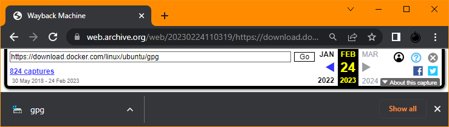

# Public Keys

This repository contains copies of Public Keys which are needed to do installations.
Sometimes, the maintainer of the key(s) would have some issue, and you'd end up ***wasting time waiting*** for them to fix the issue; and this is without possibilities to shout at them to let them know the issue and/or to urge them to pace themselves.

Obviously, this repository should be considered only as BACKUP, and NOT rely on this repositry for completeness NOR up to date information.

So instead of the usual (example) :

```
let counter=0;while ( (sudo lsof /var/cache/apt/archives/lock) || (sudo lsof /var/lib/apt/lists/lock) || (sudo lsof /var/lib/dpkg/lock*) || ((`(ps aux -A | grep -i -c "apt")` > 1)) );do let counter++;echo "$counter";if (sudo lsof /var/cache/apt/archives/lock);then printf "$counter sudo lsof /var/cache/apt/archives/lock\n`sudo lsof /var/cache/apt/archives/lock`\n";fi;if (sudo lsof /var/lib/apt/lists/lock);then printf "$counter sudo lsof /var/lib/apt/lists/lock\n`sudo lsof /var/lib/apt/lists/lock`\n";fi;if (sudo lsof /var/lib/dpkg/lock*);then printf "$counter sudo lsof /var/lib/dpkg/lock*\n`sudo lsof /var/lib/dpkg/lock*`\n";fi;if ((`(ps aux -A | grep -i -c "apt")` > 1));then printf "$counter ps aux -A | grep -i \"apt\"\n`ps aux -A | grep -i \"apt\"`\n";fi;sleep 1s;done
sudo curl -fksSL --retry 333 https://download.docker.com/linux/ubuntu/gpg | sudo apt-key add -
```

Use the `if` branch as below, to test in case the original key's repository is available or not :

```
let counter=0;while ( (sudo lsof /var/cache/apt/archives/lock) || (sudo lsof /var/lib/apt/lists/lock) || (sudo lsof /var/lib/dpkg/lock*) || ((`(ps aux -A | grep -i -c "apt")` > 1)) );do let counter++;echo "$counter";if (sudo lsof /var/cache/apt/archives/lock);then printf "$counter sudo lsof /var/cache/apt/archives/lock\n`sudo lsof /var/cache/apt/archives/lock`\n";fi;if (sudo lsof /var/lib/apt/lists/lock);then printf "$counter sudo lsof /var/lib/apt/lists/lock\n`sudo lsof /var/lib/apt/lists/lock`\n";fi;if (sudo lsof /var/lib/dpkg/lock*);then printf "$counter sudo lsof /var/lib/dpkg/lock*\n`sudo lsof /var/lib/dpkg/lock*`\n";fi;if ((`(ps aux -A | grep -i -c "apt")` > 1));then printf "$counter ps aux -A | grep -i \"apt\"\n`ps aux -A | grep -i \"apt\"`\n";fi;sleep 1s;done
if ( sudo curl -fksSL https://download.docker.com/linux/ubuntu/gpg ) ; then
 sudo curl -fksSL --retry 333 https://download.docker.com/linux/ubuntu/gpg | sudo apt-key add -
else
 sudo curl -fksSL --retry 333 https://raw.githubusercontent.com/gjwdyk/PublicKeys/main/DownloadDockerCom_LinuxUbuntu_gpg | sudo apt-key add -
fi
```

Of course, after a while key(s) may got expired, and you need to update.
And yeah, no one will set a side time to do update, when things are running well and OK.
But updating during the original key's repository is unavailable, would be pointless, right?

You can, if you're lucky, go to [Wayback Machine](https://web.archive.org/).


Enter the URI of the file you'd like to have. In this example case `https://download.docker.com/linux/ubuntu/gpg` .


Then choose the date of the copy of the file you'd like to have.
In most cases, you'd like to have the latest one.
Just click on the ending date stated on top of the chart (from the screen capture `February 24, 2023`).


Alternatively you can click on the calendar date; option of the time of the copy of the file was made appears, and you can click one of the time version you'd like.



The copy of the file of your interest will be saved to your local drive.
Rename the saved file properly and upload/update the repository for your script execution.

Obviously, the method described here only works in case only the Public Key file has issue, and not when the installer file(s) have issue.

<br><br><br>

***

<br><br><br>

List of Public Key file and their respective URI.

| URI | File |
| --- | --- |
| [https://apt.grafana.com/gpg.key](https://apt.grafana.com/gpg.key) | [AptGrafanaCom_GpgKey](AptGrafanaCom_GpgKey) |
| [https://artifacts.elastic.co/GPG-KEY-elasticsearch](https://artifacts.elastic.co/GPG-KEY-elasticsearch) | [ArtifactsElasticCo_GpgKeyElasticsearch](ArtifactsElasticCo_GpgKeyElasticsearch) |
| [https://cs.nginx.com/static/files/90pkgs-nginx](https://cs.nginx.com/static/files/90pkgs-nginx) | [CsNginxCom_StaticFiles_90PkgsNginx](CsNginxCom_StaticFiles_90PkgsNginx) |
| [https://cs.nginx.com/static/keys/app-protect-security-updates.key](https://cs.nginx.com/static/keys/app-protect-security-updates.key) | [CsNginxCom_StaticKeys_AppProtectSecurityUpdates.key](CsNginxCom_StaticKeys_AppProtectSecurityUpdates.key) |
| [https://cs.nginx.com/static/keys/nginx_signing.key](https://cs.nginx.com/static/keys/nginx_signing.key) | [CsNginxCom_StaticKeys_NginxSigning.key](CsNginxCom_StaticKeys_NginxSigning.key) |
| [https://download.docker.com/linux/ubuntu/gpg](https://download.docker.com/linux/ubuntu/gpg) | [DownloadDockerCom_LinuxUbuntu_gpg](DownloadDockerCom_LinuxUbuntu_gpg) |
| [https://nginx.org/keys/nginx_signing.key](https://nginx.org/keys/nginx_signing.key) | [NginxOrg_Keys_NginxSigning.key](NginxOrg_Keys_NginxSigning.key) |
| [https://packages.cloud.google.com/apt/doc/apt-key.gpg](https://packages.cloud.google.com/apt/doc/apt-key.gpg) | [PackagesCloudGoogleCom_AptDoc_AptKey.gpg](PackagesCloudGoogleCom_AptDoc_AptKey.gpg) |
| []() | []() |
| []() | []() |
| []() | []() |


<br><br><br>

***

<br><br><br>

Execute the following command snippet to try fetching the listed above Public Key files:

`cd $HOME;sudo curl -fksSLO --retry 333 https://raw.githubusercontent.com/gjwdyk/PublicKeys/main/FetchUpdates.sh;sudo chmod 777 $HOME/FetchUpdates.sh;sudo chown $(id -u):$(id -g) $HOME/FetchUpdates.sh;/bin/bash $HOME/FetchUpdates.sh`


<br><br><br>

***

<br><br><br>
```
╔═╦═════════════════╦═╗
╠═╬═════════════════╬═╣
║ ║ End of Document ║ ║
╠═╬═════════════════╬═╣
╚═╩═════════════════╩═╝
```
<br><br><br>


